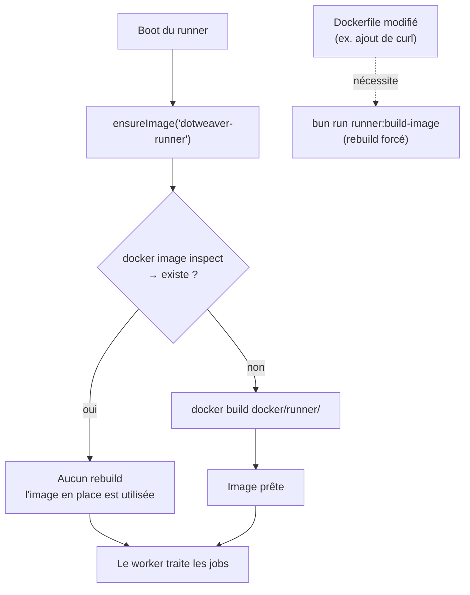

# Cycle de vie de l'image Docker agent (DOT-16)

Comment l'image `dotweaver-runner` est construite et utilisée, de l'import d'un
projet jusqu'à l'exécution d'un run dans un conteneur isolé.

## Vue d'ensemble : import → run → conteneur

```mermaid
sequenceDiagram
    actor U as Utilisateur (navigateur)
    participant K as SvelteKit<br/>(remote functions)
    participant DB as Postgres<br/>(Prisma + pg-boss)
    participant W as Runner worker<br/>(src/runner/index.ts)
    participant D as Docker / Colima
    participant C as Conteneur agent<br/>(entrypoint.mjs)

    Note over U,DB: 1 — Import du projet
    U->>K: importProject(owner, name)
    K->>K: getRepo() via token GitHub (better-auth)
    K->>DB: prisma.project.create()
    DB-->>U: Projet importé

    Note over U,DB: 2 — Lancement d'un run
    U->>K: startRun(projectId, prompt, model?)
    K->>DB: prisma.run.create(status = queued)
    K->>DB: boss.send(RUN_QUEUE, { runId })
    DB-->>U: Run "queued" (redirection vers la page run)

    Note over W,D: 3 — Boot du runner (une fois) : garantir l'image
    W->>D: ensureImage("dotweaver-runner")
    D-->>W: docker image inspect
    alt image absente (machine neuve / après colima delete)
        W->>D: docker build docker/runner/
        D-->>W: image construite
    else image présente
        Note over W,D: aucun rebuild (volontaire)
    end

    Note over W,C: 4 — Exécution du run
    W->>DB: boss.work → job { runId }
    W->>DB: transition queued → preparing
    W->>W: ensureMirror() + createRunCheckout()<br/>(branche claude/&lt;runId&gt;)
    W->>DB: transition preparing → running
    W->>D: docker run (image dotweaver-runner,<br/>checkout monté sur /workspace, env RUN_PROMPT/TOKEN/MODEL)
    D->>C: démarre le conteneur
    C->>C: Claude Code agent sur /workspace
    C-->>W: stdout JSON-lines (messages SDK)
    W->>DB: appendRunEvent() (RunEvent)
    DB-->>U: flux SSE temps réel
    C-->>D: exit 0 (commit sur la branche)
    W->>DB: getHeadSha → transition running → awaiting_review

    Note over U,DB: 5 — Review du diff → push / PR
```

## Décision `ensureImage`

L'image n'est (re)construite **que si elle manque**. Un changement du `Dockerfile`
sur une image déjà présente n'est **pas** détecté — il faut forcer le rebuild.



### Pourquoi ce compromis

- **Machine neuve / après `colima delete`** : zéro friction, l'image est buildée
  automatiquement au premier boot du runner.
- **Pas de rebuild systématique** : reconstruire à chaque démarrage serait coûteux
  et inutile dans le cas courant où l'image n'a pas changé.
- **Modif du `Dockerfile`** : geste explicite `bun run runner:build-image` pour
  que la nouvelle couche (paquets apt, etc.) se retrouve dans l'image utilisée.

## Pointeurs code

| Élément                                                                        | Fichier                                                    |
| ------------------------------------------------------------------------------ | ---------------------------------------------------------- |
| Import projet                                                                  | `src/lib/rfc/projects.remote.ts`                           |
| Lancement run + enqueue                                                        | `src/lib/rfc/runs.remote.ts`                               |
| Boot worker + `ensureImage`                                                    | `src/runner/index.ts`                                      |
| `imageExists` / `buildImage` / `ensureImage` / `buildRunArgs` / `runContainer` | `src/lib/server/docker.ts`                                 |
| Orchestration du run                                                           | `src/lib/server/run-orchestrator.ts`                       |
| Image agent                                                                    | `docker/runner/Dockerfile`, `docker/runner/entrypoint.mjs` |
| Script de rebuild forcé                                                        | `package.json` → `runner:build-image`                      |
